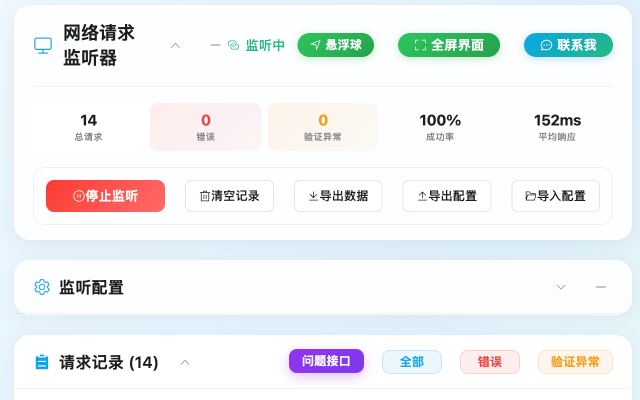
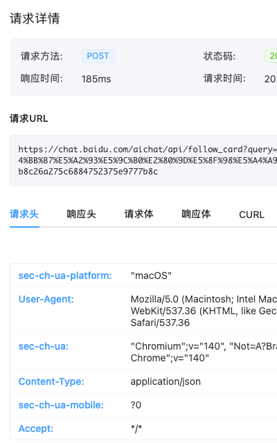
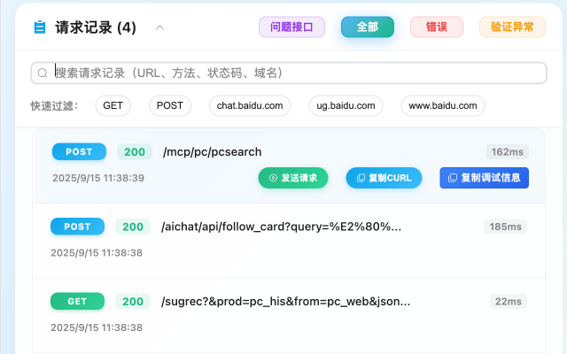
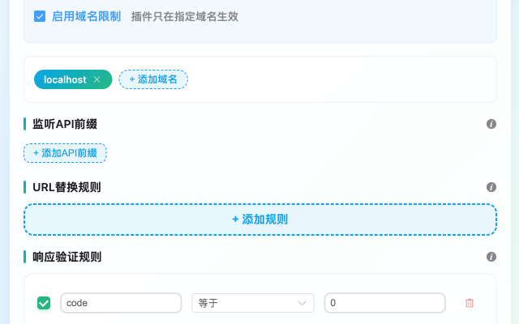

# 🔧 网络请求监听器

> 一款专为开发者、测试人员设计的Chrome扩展，解决接口调试和问题排查的痛点


📖 [安装指南](./INSTALL.md) | 📝 [更新日志](./CHANGELOG.md) | 🐛 [问题反馈](https://github.com/your-username/network-request-monitor/issues) | 💬 [讨论区](https://github.com/your-username/network-request-monitor/discussions)

## 📸 功能截图

| 主界面 | 请求详情 | 配置管理 |
|--------|----------|----------|
|  |  |  |

## 🎯 解决的问题

### 1. 📋 无法保留案发现场，偶发问题难以复现

**痛点**：出现问题才打开控制台想看日志，可是请求记录已经被清空了

**解决方案**：
- ✅ **自动监听配置的接口**：实时记录接口的入参、响应等信息
- ✅ **持久化存储**：请求记录不会因为刷新页面而丢失
- ✅ **历史记录查看**：随时回溯查看之前的请求记录



### 2. 🔍 难以排查具体异常接口

**痛点**：控制台无法自动识别哪些是服务器异常接口，得一个个看

**解决方案**：
- ✅ **智能分类**：自动识别问题接口、错误请求、验证异常
- ✅ **配置化校验规则**：针对业务状态码自定义划分接口
- ✅ **一键筛选**：快速定位有问题的接口


### 3. 🚀 复现bug麻烦

**痛点**：解决问题最快的方法之一就是复现问题，一点点复制结构过于麻烦

**解决方案**：
- ✅ **URL替换规则**：直接将接口路径替换，指向本地环境复现问题
- ✅ **一键重试**：直接发送重试请求
- ✅ **CURL导出**：复制到控制台或导入Apifox重试


### 4. 💬 业务方咨询问题无法提供有效信息

**痛点**：有问题直接截图，但截图信息很难排查问题，缺少相关日志

**解决方案**：
- ✅ **一键复制调试信息**：包含完整的请求响应、错误堆栈、环境信息
- ✅ **格式化输出**：结构化的调试信息，便于问题定位
- ✅ **降低沟通成本**：业务方可直接提供完整的技术信息


## ⚡ 核心功能

### 🎯 智能监听
- **自动识别**：根据配置的API前缀自动监听相关请求
- **实时记录**：记录请求URL、方法、参数、响应、耗时等完整信息
- **状态分类**：自动区分成功、失败、异常请求

### 🔧 配置管理
- **API前缀配置**：灵活配置需要监听的接口前缀
- **域名限制**：可限制只监听特定域名的请求
- **校验规则**：自定义响应验证规则，识别业务异常

### 📊 数据分析
- **请求统计**：显示总请求数、错误数、平均响应时间
- **智能筛选**：按问题类型、请求方法、状态码筛选
- **搜索功能**：快速搜索特定URL或参数

### 🛠️ 调试工具
- **CURL生成**：一键生成标准CURL命令
- **请求重试**：直接重新发送请求
- **调试信息复制**：包含完整上下文的调试信息

## 🚀 快速开始

### 安装方式

#### 方式一：Chrome应用商店（推荐）
1. 打开 [Chrome应用商店](https://chromewebstore.google.com/detail/ioellebholblbemjaknpjfnchngkbcjh?utm_source=item-share-cb)
2. 搜索"网络请求监听器"
3. 点击"添加至Chrome"

#### 方式二：本地安装
1. 下载最新版本的 `dist.crx` 文件
2. 打开Chrome扩展管理页面 `chrome://extensions/`
3. 开启"开发者模式"
4. 拖拽 `.crx` 文件到页面中安装

### 基本使用

1. **配置API前缀**
   ```
   https://api.example.com
   https://service.example.com/api
   ```

2. **开始监听**
   - 点击"开始监听"按钮
   - 插件会自动记录匹配的网络请求

3. **查看请求记录**
   - 点击任意请求查看详细信息
   - 使用筛选功能快速定位问题

4. **复制调试信息**
   - 点击"复制调试信息"按钮
   - 获得格式化的完整调试信息

## 📱 界面预览

### 主界面


### 请求详情弹窗


### 配置管理


## 💡 使用场景

### 🐛 Bug调试场景
```
场景：用户反馈支付失败，但无法复现
解决：
1. 配置支付相关API前缀
2. 用户操作时自动记录所有支付接口
3. 出现问题时直接查看完整的请求响应链路
4. 一键复制调试信息给开发团队
```

### 🔄 接口测试场景
```
场景：需要测试不同环境下的接口表现
解决：
1. 配置URL替换规则
2. 将生产环境接口自动替换为测试环境
3. 对比不同环境的响应差异
4. 快速切换环境进行测试
```

### 📊 性能监控场景
```
场景：监控关键接口的性能表现
解决：
1. 配置关键业务接口前缀
2. 实时监控响应时间和成功率
3. 自动识别异常慢的接口
4. 生成性能报告
```

## 🔧 开发

### 环境要求
- Node.js 18+
- Chrome 88+

### 本地开发
```bash
# 安装依赖
npm install

# 开发模式
npm run dev

# 构建
npm run build

# 类型检查
npm run type-check

# 代码检查
npm run lint
```

### 项目结构
```
src/
├── background/     # 后台脚本
├── content-script/ # 内容脚本
├── popup/          # 弹窗界面
├── standalone/     # 独立页面
├── types/          # 类型定义
└── utils/          # 工具函数
```

## 🎨 技术栈

- **前端框架**: Vue 3 + Composition API
- **UI组件库**: Element Plus
- **开发语言**: TypeScript
- **样式预处理**: SCSS
- **构建工具**: Vite
- **代码规范**: ESLint + Prettier

## 📄 许可证

MIT License

## 🤝 贡献

欢迎提交Issue和Pull Request！

## 📞 联系我们

- 微信：glowxq
- 邮箱：glowxq@qq.com

---

⭐ 如果这个项目对你有帮助，请给个Star支持一下！
